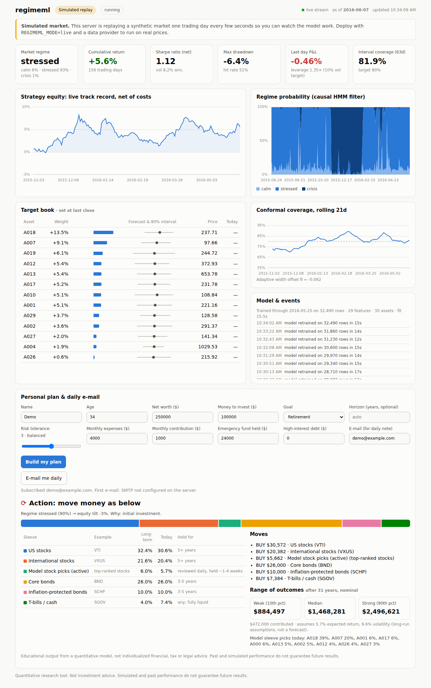

# regimeml: a live, regime-aware ML investing model with a web dashboard and daily e-mail advice

`regimeml` does three things:

1. **Predicts the market.** Its model ranks stocks every day and reads the market's "mood": calm, stressed or crisis.
2. **Shows it live on the web.** A dashboard streams the model's signals, track record, regime and target portfolio in real time.
3. **Acts as a personal allocation adviser.** It turns a person's age, goal, net worth, horizon and risk tolerance into a portfolio plan, then **e-mails a note every trading day** saying whether to move money and where.



> **Honesty first.** This is a quantitative research tool, not a licensed financial adviser.
> - The backtest numbers below come from a **simulated** market with a known answer key, which proves the pipeline works; they are not a claim about real markets.
> - Run it on real data in paper mode before trusting it with money, and talk to a fee-only fiduciary adviser for decisions about your finances.

---

## How the model works

| Stage | What it does | Why it matters |
|---|---|---|
| **Regime detection** | A Gaussian hidden Markov model, written from scratch, reads cross-sectional dispersion and market returns. It reports *filtered* probabilities P(calm, stressed, crisis \| data up to today). | Most libraries return *smoothed* probabilities, which quietly use the future. This one is causal. |
| **Forecasting** | Gradient boosting plus a ridge ensemble on about 25 leak-free features. Regime probabilities and regime × signal interactions are added as inputs. | The same signal can flip sign between calm and crisis markets, and the model learns that. |
| **Uncertainty** | Conformalized quantile regression gives each forecast an 80% interval with a finite-sample guarantee. **Adaptive conformal tracking** then widens or narrows intervals online as the market drifts. | Coverage stays on target even when volatility changes. |
| **Sizing** | Position = expected return ÷ interval width, made dollar-neutral, capped at 10% per name, smoothed to cut turnover, and scaled to a 10% volatility target. | Bets big only when the model is both directional *and* confident. |
| **Honest evaluation** | Purged walk-forward CV with an embargo, 5 bp transaction costs, and the Deflated Sharpe Ratio. | Hard to fool yourself. |

### Backtest (out of sample, simulated market with planted ground truth)

The test covers about 8.5 years of walk-forward data across 40 assets, net of costs, at a 10% volatility target:

| Variant | Net Sharpe | IC (t-stat) | Max DD | Deflated Sharpe | 80% interval coverage | Avg. coverage error, 63-day windows |
|---|---|---|---|---|---|---|
| **regime + conformal sizing** (production) | **0.59** | 0.025 (7.5) | **-18.9%** | **0.81** | 80.0% | **1.8pp** (static: 2.2pp) |
| regime, point forecast | 0.51 | 0.025 (7.5) | -19.6% | 0.74 | 80.0% | 1.8pp |
| regime-blind | 0.13 | 0.019 (5.4) | -36.0% | 0.32 | 80.0% | 2.0pp |
| *oracle: true planted signal (ceiling)* | *1.08* | *0.035 (10.5)* | *-25.1%* | — | — | — |

- The HMM identifies the hidden regime **84%** of the time using only past data.
- Adaptive conformal tracking keeps coverage closer to target across the test period than static intervals (1.8pp vs 2.2pp average error).

The simulator hides a signal that **reverses by regime**. The regime-blind model sees the two effects largely cancel out, which is why its result is poor.

---

## Run it

```bash
pip install -e ".[dev,yahoo]"
pytest -q                                          # 35 tests

# 1) Live web dashboard: simulated market, no keys needed
uvicorn regimeml.server:app --port 8000            # open http://localhost:8000

# 2) Live web dashboard on REAL market data
REGIMEML_MODE=live REGIMEML_PROVIDER=yahoo REGIMEML_TOKEN=choose-a-password \
  uvicorn regimeml.server:app --port 8000          # open http://localhost:8000/?token=choose-a-password

# 3) Research backtest -> reports/
python -m regimeml.pipeline
```

### What the dashboard shows (updates in real time via server-sent events)

- **Header tiles:** current market regime, cumulative return, Sharpe ratio, max drawdown, today's P&L (marked to market intraday while the exchange is open), and interval coverage.
- **Equity curve** of the live paper track record, net of costs.
- **Regime probabilities** for the last year.
- **Target book:** each stock's weight, forecast, 80% interval, price and move today.
- **Coverage chart and model events:** retrains, errors, e-mails sent.
- **Personal plan form:** enter your profile and get an allocation, today's moves, holding periods and a range of outcomes. "E-mail me daily" subscribes you to the daily note.

### How the engine runs in live mode

1. It pulls daily bars and, during market hours, live quotes.
2. It retrains after each close in a background thread.
3. On each new close, it realises yesterday's P&L and sets the new book.
4. Optionally, it rebalances through Alpaca 10 minutes before the close (`REGIMEML_AUTOTRADE=true`; paper account unless `ALPACA_PAPER=false`).

The track record and subscribers persist in `REGIMEML_STATE_DIR`. If the server is down for several days, the missed days are realised as one multi-day P&L entry when it returns.

---

## The personal adviser

The input is age, net worth, money to invest, goal (retirement, grow wealth, home, education, income, preserve capital), optional horizon, risk tolerance (1–5), monthly expenses, contributions, emergency fund and high-interest debt.

The method is transparent and rules-based:

1. **Foundations first:** top up a 6-month emergency fund, then pay off high-interest debt, before investing.
2. **Horizon caps risk:** money needed within 2 years holds no stocks; under 5 years, at most 40% stocks; 5–10 years, at most 70%.
3. **Stock share** = min(horizon capacity, risk-tolerance level, age guard-rail for retirement).
4. **Low-cost diversified core:**
   - US stocks (e.g. VTI)
   - International stocks (VXUS)
   - Bonds (BND)
   - Inflation-protected bonds (SCHP)
   - T-bills (SGOV)
   - Plus a model stock-pick sleeve capped at 10% of stocks, only for 5+ year horizons.
5. **Daily tactical tilt from the regime model:** at most −12pp stocks in a crisis and +3pp when calm, moved to and from T-bills.
6. **Daily verdict: "hold" or "rebalance".** It only says rebalance when a sleeve drifts more than 5pp or the regime tilt moves at least 3pp. Moving all your money every day would lose to costs and taxes, so most days the right answer is *hold*, and the e-mail says so.
7. **Range of outcomes:** a Monte-Carlo projection of the 10th, 50th and 90th percentiles from stated long-run assumptions. These are assumptions, not forecasts.

It's available three ways:

- **Command line:** `python -m regimeml.advise --profile examples/profile.json [--provider yahoo] [--email]`
- **Web form:** on the dashboard.
- **Daily e-mail:** from the web server after each close, or from the `daily-advice` GitHub Actions workflow with no server at all.

### E-mail setup (any SMTP provider)

| Provider | SMTP_HOST | Notes |
|---|---|---|
| Gmail | `smtp.gmail.com` (port 587) | needs 2-step verification and an [app password](https://myaccount.google.com/apppasswords) |
| SendGrid | `smtp.sendgrid.net` | user `apikey`, password = API key |
| Mailgun / SES / Postmark | per provider | |

Set `SMTP_HOST`, `SMTP_PORT`, `SMTP_USER`, `SMTP_PASSWORD`, `EMAIL_FROM`, and `EMAIL_TO` for the CLI or workflow.

---

## Real market data

Set `REGIMEML_PROVIDER` (web) or `--provider` (CLI), plus the provider's key:

| Provider | Cost | Credentials | Live quotes |
|---|---|---|---|
| `yahoo` | free | none | yes |
| `stooq` | free | none | no (daily only) |
| `alpaca` | free tier | `ALPACA_API_KEY`, `ALPACA_SECRET_KEY` | yes. **Recommended**: data plus paper/live trading |
| `polygon` | free / paid | `POLYGON_API_KEY` | yes (paid plans) |
| `tiingo` | free / paid | `TIINGO_API_KEY` | daily |
| `fmp` | free / paid | `FMP_API_KEY` | daily |
| `alphavantage` | free (25 calls/day) | `ALPHAVANTAGE_API_KEY` | daily |
| `twelvedata` | free / paid | `TWELVEDATA_API_KEY` | daily |
| `eodhd` | free / paid | `EODHD_API_KEY` | daily |
| `bloomberg` | Terminal / B-PIPE | Terminal running locally (`BLP_HOST`, `BLP_PORT`) | daily |

For Bloomberg, install `blpapi` from `https://blpapi.bloomberg.com/repository/releases/python/simple/`.

## Deploy (always-on website)

- **Render:** `render.yaml` is included. Use New + → Blueprint → this repo, then enter the secrets. It needs an always-on instance with a disk, because the free tier sleeps and forgets the track record.
- **Docker, anywhere** (Fly.io, Railway, a VPS, Kubernetes):
  `docker build -t regimeml . && docker run -p 8000:8000 -v regimeml-data:/data --env-file .env regimeml`
- **No server:** the `daily-advice` workflow e-mails you each weekday using GitHub Actions only.

Always set `REGIMEML_TOKEN` on a public deployment. It password-protects the data endpoints and is required for e-mail sign-ups, so strangers can't use your server to send mail.

## Layout

```
regimeml/
  data.py         regime-switching simulator (ground truth) + CSV/Yahoo loaders
  features.py     leak-free features and targets
  regimes.py      Gaussian HMM from scratch (Baum-Welch, causal filtering)
  cv.py           purged walk-forward CV with embargo
  model.py        regime-aware GBM + ridge, CQR intervals, adaptive conformal tracking
  backtest.py     dollar-neutral capped weights, costs, vol targeting, PSR / deflated Sharpe
  pipeline.py     research CLI and report
  providers.py    10 market-data connectors with live quotes where supported
  broker.py       Alpaca execution (paper by default, splits position flips, per-order caps)
  engine.py       always-on live engine: retraining, daily roll, track record, autotrade
  server.py       FastAPI app: dashboard, JSON + server-sent-events API, advice, sign-ups
  web/            dashboard (vanilla JS + bundled Chart.js, light/dark, mobile)
  advisor.py      profile -> strategic plan -> daily action -> projection
  notify.py       HTML/text e-mail over SMTP
  subscribers.py  subscriber store + daily send job
  advise.py       one-shot daily advice CLI (cron / GitHub Actions)
  live.py         one-shot target-portfolio CLI with optional order execution
```

Not investment advice. Paper-trade first.
