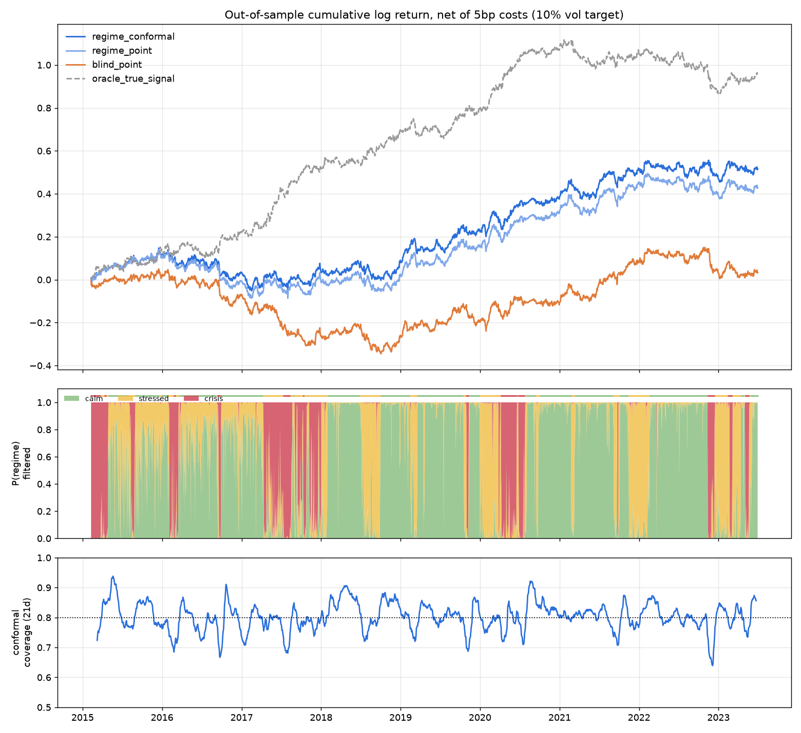

# regimeml: regime-aware, conformally-calibrated ML for equity trading

A research-to-production pipeline for cross-sectional stock selection. It combines:

1. **Hidden-Markov regime detection, written from scratch and strictly causal.** A Gaussian HMM reads daily market observables (cross-sectional dispersion and market return). It outputs *filtered* probabilities P(regime | data up to today). Most libraries return *smoothed* probabilities by default, and those quietly use the future.
2. **A regime-conditioned ensemble.** Gradient boosting and ridge regression are trained on about 25 leak-free features, the regime probabilities, and regime × signal interactions. That lets the model learn that the same signal can flip sign between calm and stressed markets.
3. **Conformalized quantile regression (CQR).** Every prediction comes with an interval that has a finite-sample coverage guarantee. A position is sized by *expected return ÷ interval width*: the book bets big only when the model is both directional *and* confident.
4. **Evaluation that is hard to fool yourself with.**
   - Purged walk-forward cross-validation with an embargo, so overlapping labels can't leak.
   - Transaction costs, causal volatility targeting, and turnover smoothing.
   - The **Deflated Sharpe Ratio**, which corrects for the number of strategy variants tried.
5. **Real-market connectors and execution.** Supported sources are Yahoo, Stooq, Alpaca, Polygon, Tiingo, Financial Modeling Prep, Alpha Vantage, Twelve Data, EODHD and Bloomberg (`blpapi`). Orders go through Alpaca's trading API, on paper by default.

## Results (out of sample, simulated market with planted ground truth)



The results use about 8.5 years of walk-forward test data across 40 assets, net of 5 bp costs, at a 10% volatility target:

| variant | net Sharpe | IC | IC t-stat | max DD | deflated Sharpe | 80% interval coverage |
|---|---|---|---|---|---|---|
| **regime + conformal sizing** | **0.57** | 0.025 | 7.5 | -20% | **0.80** | 80.2% |
| regime, point forecast | 0.48 | 0.025 | 7.5 | -23% | 0.71 | 80.2% |
| regime-blind | 0.04 | 0.019 | 5.4 | -40% | 0.23 | 80.0% |
| *oracle (true signal, upper bound)* | *1.08* | *0.035* | *10.5* | *-26%* | — | — |

What this shows:

- **Regimes matter.** The simulator plants a signal that *reverses sign by regime*. A regime-blind model sees the two effects partly cancel out.
- **Conformal sizing adds value.** It adds roughly 0.1 Sharpe on top of the point forecast.
- **The intervals are calibrated.** Coverage matches the 80% target.
- **The HMM tracks the true regimes.** It is 84% accurate against the hidden regime, using only past data.

**Honesty note:** these numbers come from a *simulated* market. That is on purpose: when the ground truth is known, you can check that the pipeline finds real structure instead of fitting noise. Nothing here is a claim that it will make money on real prices. Run the same research pipeline on real data (below) before risking capital.

## Quick start

```bash
pip install -e ".[dev,yahoo]"
pytest -q                                    # 17 tests, ~40s
python -m regimeml.pipeline                  # full simulated research run -> reports/
python -m regimeml.pipeline --csv prices.csv # same research run on your own price file
python -m regimeml.pipeline --tickers AAPL MSFT JPM XOM ...   # research on Yahoo data
```

## Connecting to the real market

Every provider returns the same thing: a DataFrame of adjusted daily closes. Pick one and set its credentials (see `.env.example`):

| provider | cost | credentials | notes |
|---|---|---|---|
| `yahoo` | free | none | unofficial; good for research |
| `stooq` | free | none | daily CSV |
| `alpaca` | free tier | `ALPACA_API_KEY`, `ALPACA_SECRET_KEY` | **recommended**: data plus paper/live trading with one key |
| `polygon` | free tier / paid | `POLYGON_API_KEY` | high-quality US data |
| `tiingo` | free tier / paid | `TIINGO_API_KEY` | clean EOD data |
| `fmp` | free tier / paid | `FMP_API_KEY` | Financial Modeling Prep; also has fundamentals |
| `alphavantage` | free tier (25 calls/day) | `ALPHAVANTAGE_API_KEY` | |
| `twelvedata` | free tier / paid | `TWELVEDATA_API_KEY` | global coverage |
| `eodhd` | free tier / paid | `EODHD_API_KEY` | global exchanges |
| `bloomberg` | Terminal / B-PIPE licence | Terminal running locally (`BLP_HOST`, `BLP_PORT`) | `pip install blpapi --index-url=https://blpapi.bloomberg.com/repository/releases/python/simple/` |

### Daily live signal

```bash
cp .env.example .env    # add your keys
set -a; . ./.env; set +a

python -m regimeml.live --provider alpaca                 # dry run: prints the regime, target weights and planned orders
python -m regimeml.live --provider alpaca --execute       # submits market orders (PAPER account by default)
python -m regimeml.live --provider tiingo --long-only     # no shorting, for cash accounts
```

Each run refits on all labelled history, scores the latest close, and writes `signals/weights_<date>.csv` plus a JSON log.

Safety rails:

- Trading is on paper unless `ALPACA_PAPER=false`.
- It is a dry run unless you pass `--execute`.
- Each order is capped by `--max-order` (default $25k).
- Only whole shares are traded.

### Deploy

- **Docker:** `docker build -t regimeml . && docker run --env-file .env regimeml --provider alpaca`
- **GitHub Actions:** `.github/workflows/daily-signal.yml` runs on weekdays after the US close. Add your keys as repository secrets. It runs as a dry run unless it is triggered manually with `execute=true`.
- **Any cron or Kubernetes CronJob:** run `regimeml-live --provider <name>` once a day.

## Layout

```
regimeml/
  data.py       regime-switching market simulator (ground truth) + CSV/Yahoo loaders
  features.py   leak-free features and targets
  regimes.py    Gaussian HMM from scratch (Baum-Welch, causal filtering)
  cv.py         purged walk-forward CV with embargo
  model.py      regime-aware GBM + ridge ensemble with CQR intervals
  backtest.py   portfolio construction, costs, vol targeting, PSR / deflated Sharpe
  pipeline.py   research CLI and report
  providers.py  real-market data connectors
  broker.py     Alpaca order execution
  live.py       production daily-signal CLI
```

Not investment advice. Paper-trade first.
